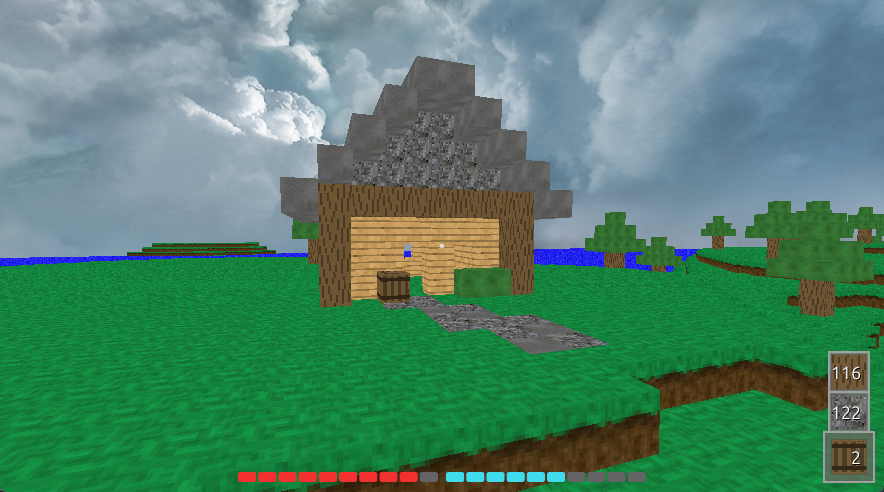
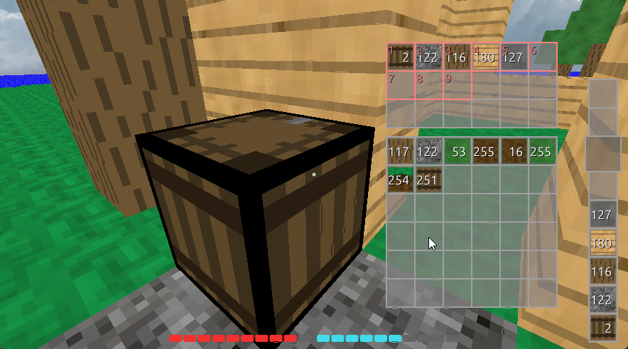

# Protovox Engine
An optimized, ECS based, multiplayer game engine prototype written in Rust. Intended to recreate the RPG experience of heavily modded Minecraft.

## Features
- ECS architecture for performance and easy to design features
  - Modular systems that run in parallel
  - 
- Designed with multiplayer in mind
  - All players can interact with the game world
  - Host manages and updates all chunks, sends to clients
  - Custom packet library & networking implementation
- Uses perlin noise for world generation
- World features created through [splines](https://youtu.be/ob3VwY4JyzE) via custom spline library
- Custom rendering engine built with wgpu
  - Runs natively on many platforms and graphics APIs
  - Special optimizations for voxels (252 bytes/voxel → 12 bytes/voxel)
  - Gizmos for debugging, chunk borders, etc.
  - Skybox
- Inventory and item system
- Structure system
- WIP Chat implementation

## Images
### Example House

### Inventory

## Art
- All block & item textures are made by [dinoslice](https://github.com/dinoslice)
- Skybox from [OpenGameArt.org](https://opengameart.org/content/miramar-skybox)
